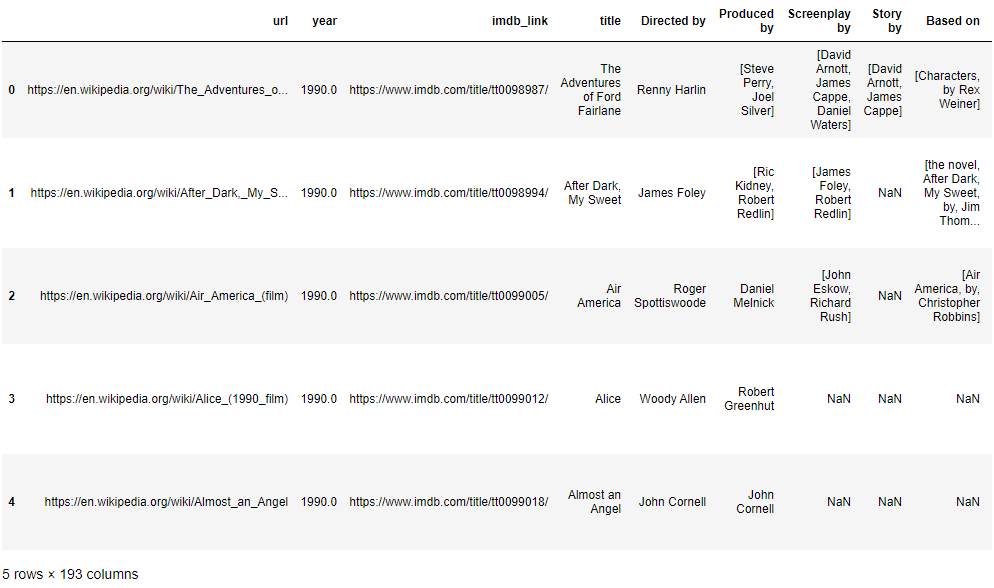
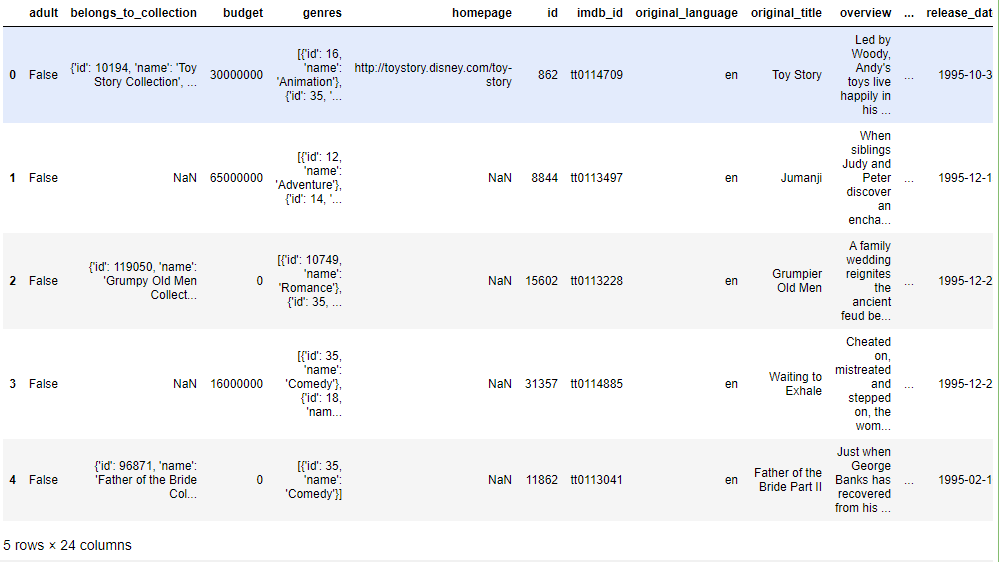
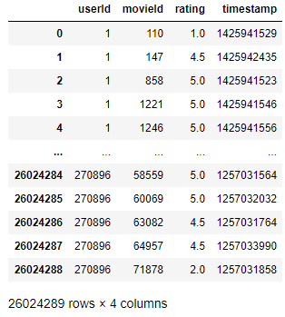
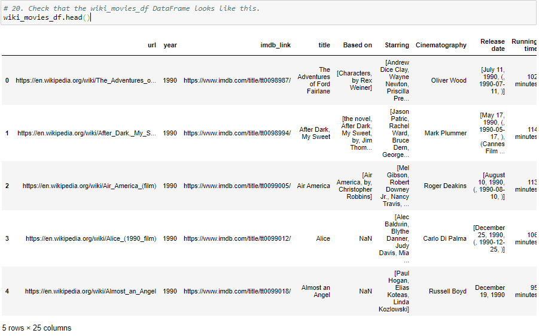
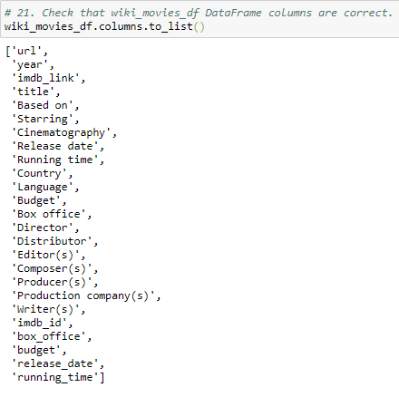
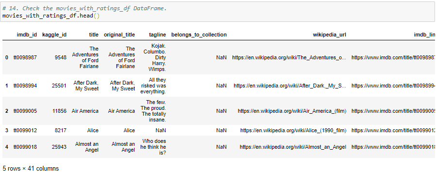
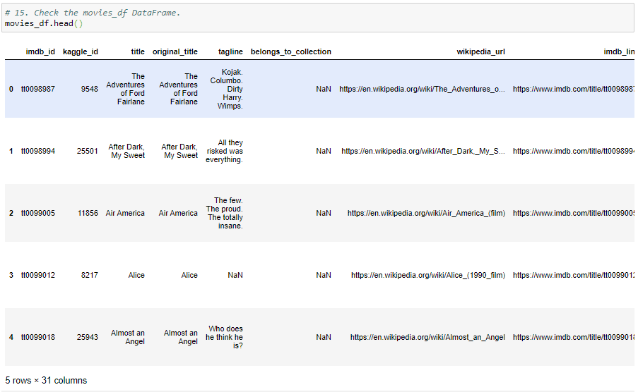
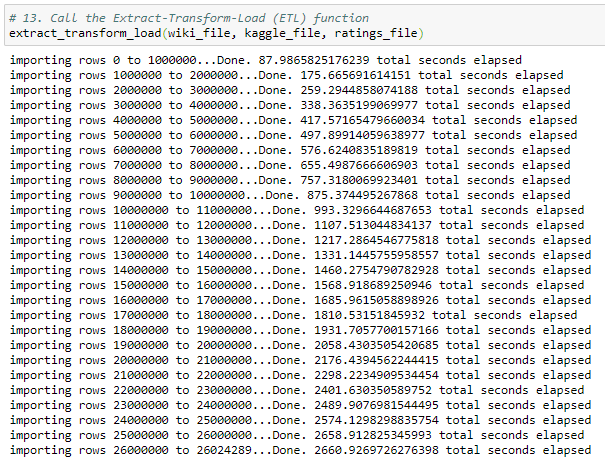
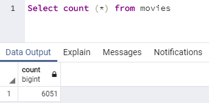
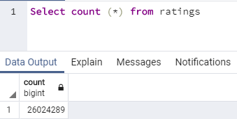

# Movies-ETL
New project on Movies ETL analysis. Making changes to the weather app.

## Project Overview
This project will be using Python, Pandas, the ETL process, and code refactoring to create an automated pipeline that takes in new data, performs the appropriate transformations, and loads the data into existing tables. Code will be needed to be refactored to create one function that takes in the three files—Wikipedia data, Kaggle metadata, and the MovieLens rating data—and performs the ETL process by adding the data to a PostgreSQL database. Ergo, this assignment consists of four technical deliverables. They are:

- Deliverable 1: Write an ETL Function to Read Three Data Files
- Deliverable 2: Extract and Transform the Wikipedia Data
- Deliverable 3: Extract and Transform the Kaggle data
- Deliverable 4: Create the Movie Database

Working with the `ETL_Deliverable1_starter_code.ipynb`, `ETL_Deliverable2_starter_code.ipynb`, `ETL_Deliverable3_starter_code.ipynb`, `ETL_Deliverable4_starter_code.ipynb`  starter codes, Pandas `json.load()`, `try-except`, and `parse_dollars()`, `replace`, `if_exists`, functions/methods will be used to find the requested results. The results will be printed to the command line and saved to the Resources folder.

## Purpose
The purpose of this project is to create an automated pipeline that takes in new data, performs the appropriate transformations, and loads the data into existing tables. This project intends to deliver on all four (4) deleverables previously outlined.

## Resources
- **Data Source:** ETL_Deliverable1_starter_code.ipynb, ETL_Deliverable2_starter_code.ipynb, ETL_Deliverable3_starter_code.ipynb, ETL_Deliverable4_starter_code.ipynb, config.py, ratings.csv, movies_metadata.csv
- **Software:** Anaconda 4.8.3, Jupyter Notebook 6.0.3, Visual Code 1.47, Python 3.7.6, PgAdmin4

## Movies ETL Results
>
>
### **Retrieving Movies ETL Results**
>Code was refactored from `JSON Practice.ipynb` to create one function that takes in the three files—Wikipedia data, Kaggle metadata, and the MovieLens rating data—and performs the ETL process by adding the data to a PostgreSQL database.
>
>
### **Deliverable 1: Write an ETL Function to Read Three Data Files s**
>Python, Pandas, the ETL process,and code refactoring, was used to write a function that reads in the three data files and creates three separate DataFrames.
>
>**Wiki movies DataFrame from the terminal:**
>
>
>
>
>**Kaggle Metadata from the terminal:**
>
>
>
>
>**Ratings from the terminal:**
>
>
>
>
### **Deliverable 2: Extract and Transform the Wikipedia Data Results**
>Python, Pandas, the ETL process, and code refactoring, was used to extract and transform the Wikipedia data so you can merge it with the Kaggle metadata. While extracting the IMDb IDs using a regular expression string and dropping duplicates, a `try-except` block was used to catch errors.
>
>
>**Wiki Movies dataframe from the terminal:**
>
>
>
>**Wiki Movies dataframe columns list from the terminal:**
>
>
>
>
### **Deliverable 3: Extract and Transform the Kaggle Data**
>Python, Pandas, the ETL process, and code refactoring, was used to extract and transform the Kaggle metadata and MovieLens rating data, then convert the transformed data into separate DataFrames. Then, the Kaggle metadata DataFrame was merge  with the Wikipedia movies DataFrame to create the movies_df DataFrame. Finally, the MovieLens rating data DataFrame was  merge with the movies_df DataFrame to create the movies_with_ratings_df
>
>
>**Movies with ratings dataframe from the terminal:**
>
>
>
>**Movies dataframe from the terminal:**
>
>
>
>
### **Deliverable 4: Create the Movie Database**
>Python, Pandas, the ETL process, code refactoring, and PostgreSQL was used to add the movies_df DataFrame and MovieLens rating CSV data to a SQL database.
>
>
>**Loading ratings to PostgresSQL from the terminal:**
>
>
>
>
>**Movies with ratings dataframe from the terminal:**
>
>
>
>**Ratings query from the terminal:**
>
>
>
>
